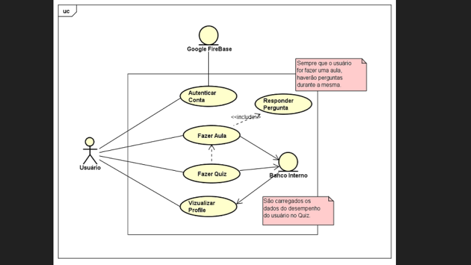
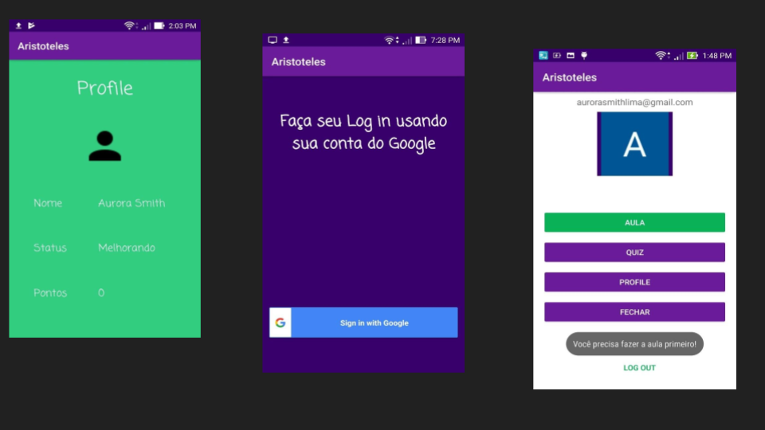
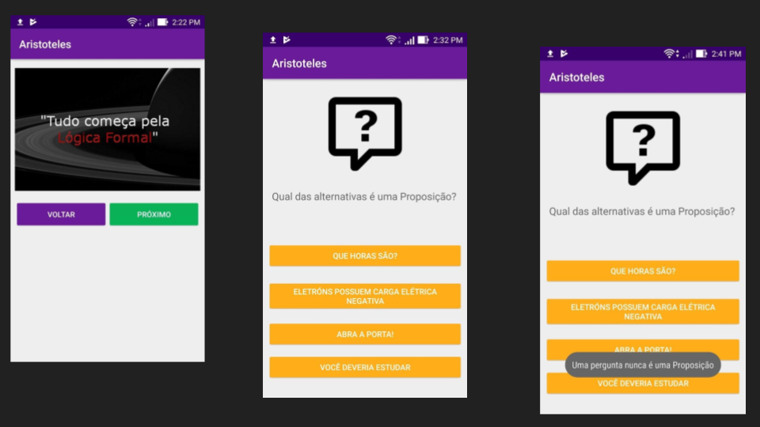
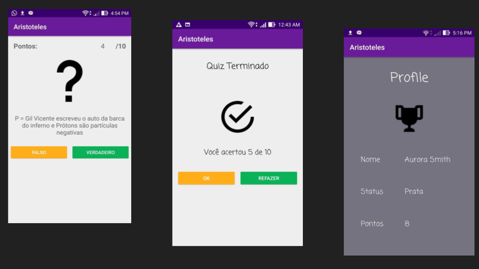

# Aristoteles

This is the functinal prototype of Aristoteles. It's a mobile App whose focus is to help students to learn propositional logics. 
This is part of my research required to conclude the graduation in System Analysis from the Federal Institute of Science, Study and Technology from São Paulo and
where I tried to combine neuroscience and mobile learning to improve the logical thinking development in students. 

## The technologies used to program this prototype were:
- Java (backend programming)
- SQLite (Used to store the data from the software)
- Firebase (Used to authenticate and manage users profiles)
- UML (Used to document the software)

## The final document of the project:
<a href=TCC_JHONES.pdf target="_blank">PROPOSTA DE DESENVOLVIMENTO DE APLICATIVO MÓVEL PARA O ENSINO DE MATEMÁTICA COMPUTACIONAL E LÓGICA FORMAL BASEADO NO ESTUDO DA NEUROCIÊNCIA
</a>

## Use Case Diagram:

## A couple of images:

